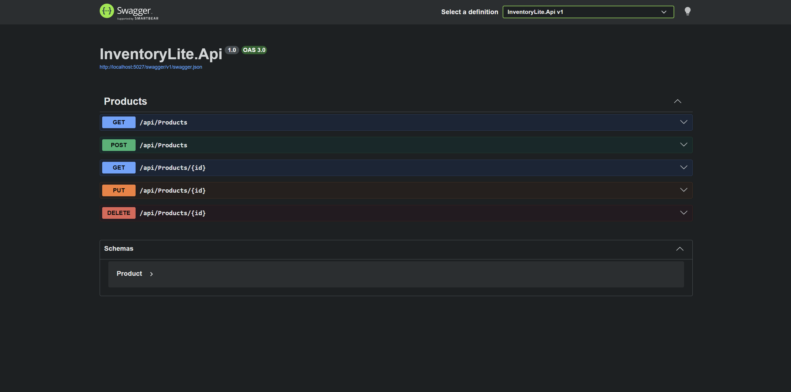
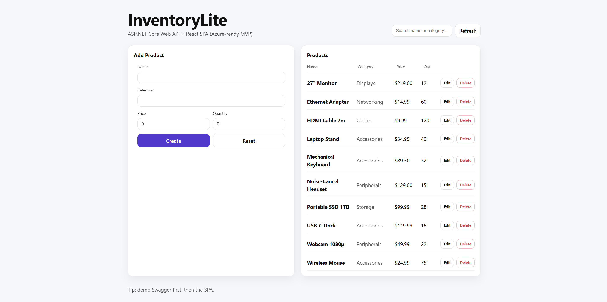
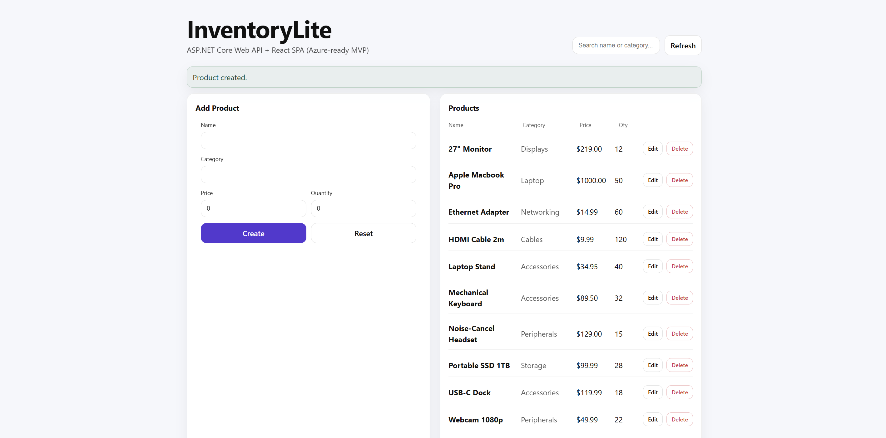
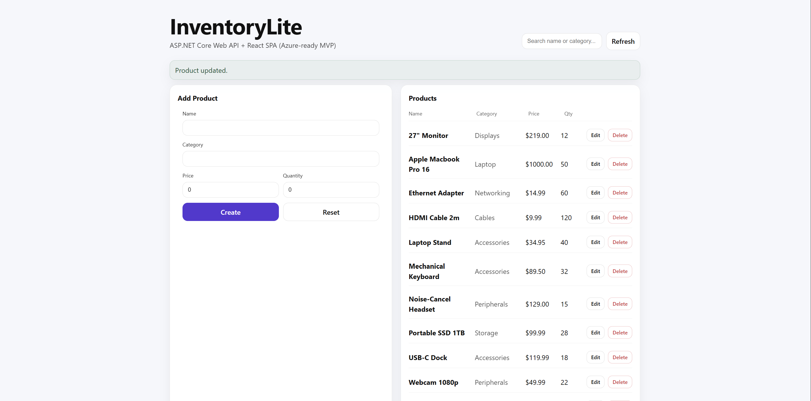
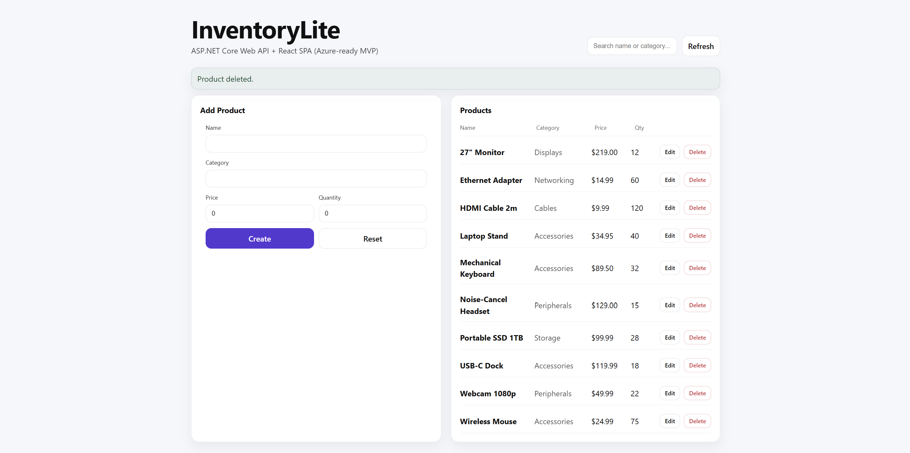

# InventoryLite

Cloud-ready ASP.NET Core Web API + React (TypeScript) SPA demonstrating REST APIs, service layering, and Azure deployment readiness.

## Tech
- API: ASP.NET Core Web API (C#)
- Data: EF Core (SQLite for MVP speed)
- Client: React + TypeScript (Vite)
- Docs: Architecture + test plan + Azure deploy notes

## Run (Local)
### API
```bash
cd src/InventoryLite.Api
dotnet restore
dotnet ef database update
dotnet run
```

## Screenshots

### Swagger API


### Products List


### Add Product


### Edit Product


### Delete Confirmation

